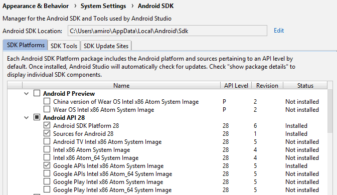
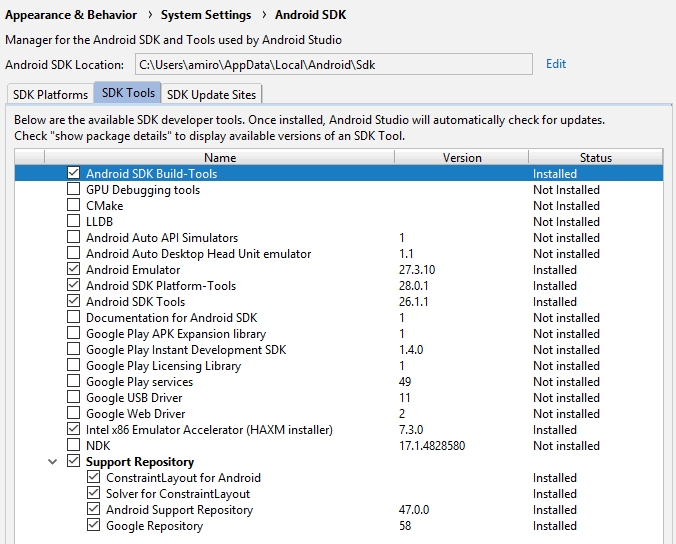

### Использование Intel HAXM

Эмулятор Android тормозит, т. к. ему приходится исполнять команды, предназначенные для процессора ARM. Но часто можно вместо ARM запустить в эмуляторе образ, ориентированный на архитектуру Intel x86. В этом случае процессор будет исполнять родные команды, и эмулятор забегает быстрее. Эта возможность полагается на Intel Hardware Accelerated Execution Manager (HAXM) - прослойку из драйверов Intel, дающую возможность запускать код Android напрямую на процессоре PC (с некоторыми ограничениями, естественно).

Используя Intel HAXM, можно запустить несколько экземпляров Android-эмулятора на одном компьютере, не особо беспокоясь о производительности, о нагрузке на систему или о «тормозах» интерфейса.

Устанавливается в SDK Manager:

образы (см. Intel x86 Atom System Image)

и собственно эмулятор (см. Intel x86 Emulator Accelerator)

Инструкции по установке: https://github.com/intel/haxm/wiki/Installation-Instructions-on-Windows
