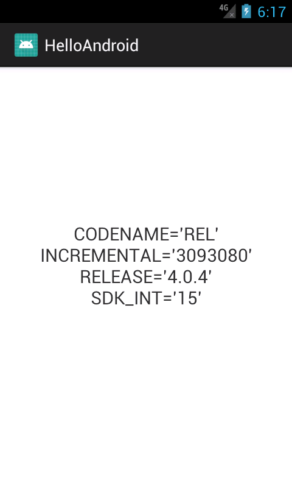

### Версии Android

| Версия | API Level | Название | Год | Доля
|--------|-----------|----------|-----|----
| 1.0 | 1 | (none) | 2008 |  ?
| 1.1 | 2 | Petit Four | 2009 | ?  
| 1.5 | 3 | Cupcake | 2009 | ?
| 1.6 | 4 | Donut | 2009 | ?
| 2.0-2.1 | 5-7 | Eclair | 2009 | ?  
| 2.2-2.2.3 | 8 | Froyo | 2010 |  ?
| 2.3-2.3.7 | 9-10 | Gingerbread | 2010 | 0.2%
| 3.0-3.2.6 | 11-13 | Honeycomb | 2011 | ?
| 4.0-4.0.4 | 14-15 | Ice Cream Sandwich | 2011 | 0.3%
| 4.1-4.3.1 | 16-18 | Jelly Bean | 2012 | 1.2%
| 4.4-4.4.4 | 19-20 | KitKat | 2013 | 9.1%
| 5.0-5.1.1 | 21-22 | Lollipop | 2014 | 20.4%
| 6.0-6.0.1 | 23 | Marshmallow | 2015 | 23.5%
| 7.0-7.1.2 | 24-25 | Nougat | 2016 | 30.8%
| 8.0-8.1 | 26-27 | Oreo | 2017 | 12.1%
| 9.0 | 28 | Pie | 2018 | &lt; 0.1%

#### Как узнать версию Android

Надо проверить класс `android.os.Build.VERSION`. В нем содержатся различные константы, из которых для нас важнее всего `SDK_INT`, т. е. тот самый API Level (см. таблицу).


```text
SDK_INT value        Build.VERSION_CODES        Human Version Name       
    1                  BASE                      Android 1.0 (no codename)
    2                  BASE_1_1                  Android 1.1 Petit Four
    3                  CUPCAKE                   Android 1.5 Cupcake
    4                  DONUT                     Android 1.6 Donut
    5                  ECLAIR                    Android 2.0 Eclair
    6                  ECLAIR_0_1                Android 2.0.1 Eclair                  
    7                  ECLAIR_MR1                Android 2.1 Eclair
    8                  FROYO                     Android 2.2 Froyo
    9                  GINGERBREAD               Android 2.3 Gingerbread
   10                  GINGERBREAD_MR1           Android 2.3.3 Gingerbread
   11                  HONEYCOMB                 Android 3.0 Honeycomb
   12                  HONEYCOMB_MR1             Android 3.1 Honeycomb
   13                  HONEYCOMB_MR2             Android 3.2 Honeycomb
   14                  ICE_CREAM_SANDWICH        Android 4.0 Ice Cream Sandwich
   15                  ICE_CREAM_SANDWICH_MR1    Android 4.0.3 Ice Cream Sandwich
   16                  JELLY_BEAN                Android 4.1 Jellybean
   17                  JELLY_BEAN_MR1            Android 4.2 Jellybean
   18                  JELLY_BEAN_MR2            Android 4.3 Jellybean
   19                  KITKAT                    Android 4.4 KitKat
   20                  KITKAT_WATCH              Android 4.4 KitKat Watch
   21                  LOLLIPOP                  Android 5.0 Lollipop
   22                  LOLLIPOP_MR1              Android 5.1 Lollipop
   23                  M                         Android 6.0 Marshmallow
   24                  N                         Android 7.0 Nougat
   25                  N_MR1                     Android 7.1.1 Nougat
   26                  O                         Android 8.0 Oreo
   27                  O_MR1                     Android 8 Oreo MR1
   28                  P                         Android P
  10000                CUR_DEVELOPMENT           Current Development Version
```

Вот программа, выдающая на экран версию:

```java
package com.example.amiro.helloandroid;

import android.app.Activity;
import android.os.Build;
import android.os.Bundle;
import android.widget.TextView;

public class MainActivity extends Activity {

    @Override
    protected void onCreate(Bundle savedInstanceState) {
        super.onCreate(savedInstanceState);
        setContentView(R.layout.activity_main);

        StringBuilder builder = new StringBuilder();
        builder.append("CODENAME='" + Build.VERSION.CODENAME + "'");
        builder.append('\n');
        builder.append("INCREMENTAL='" + Build.VERSION.INCREMENTAL + "'");
        builder.append('\n');
        builder.append("RELEASE='" + Build.VERSION.RELEASE + "'");
        builder.append('\n');
        builder.append("SDK_INT='" + Build.VERSION.SDK_INT + "'");
        builder.append('\n');

        TextView textView = findViewById(R.id.helloLabel);
        textView.setText(builder.toString());
    }
}
```

Вот что она выводит на экран:

